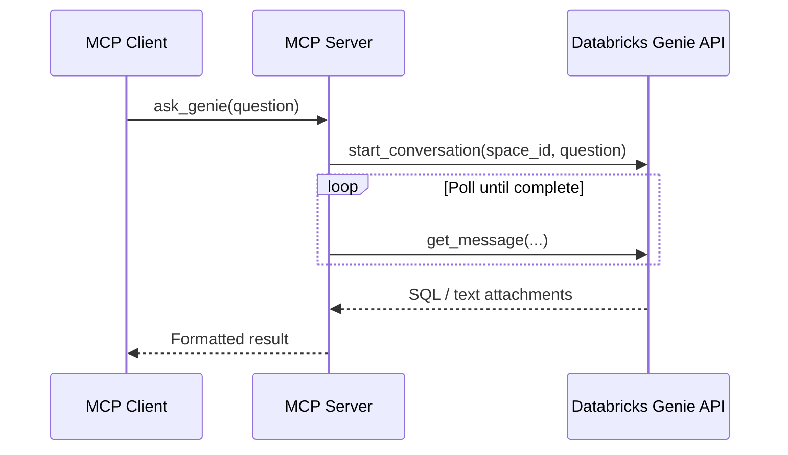

# Databricks Genie MCP Server

A [Model Context Protocol (MCP)](https://modelcontextprotocol.io/) server that lets AI assistants query your [Databricks Genie](https://www.databricks.com/product/genie) space in natural language. Genie translates questions into SQL and returns results from your configured data sources.

## Why this project?

Databricks offers a **managed Genie MCP server**, but it is tied to account-console **Preview** access and is not available on the **Free Edition** workspace. If you are on Free Edition (or otherwise cannot enable that preview), you cannot register Databricks’ hosted MCP endpoint in Claude Desktop, Cursor, or similar clients.

This project is a **local bridge** that does the same job differently:

- Runs a small MCP server on your machine (optionally in Docker).
- Talks to Genie through the **Genie REST API** using your workspace host and a **personal access token** — no managed MCP endpoint and no preview toggle required.
- Exposes `ask_genie` and `list_space_info` to your MCP client over stdio, the same way a hosted server would.

In short: you get Genie-in-your-AI-assistant on Free Edition by implementing the MCP protocol locally and calling Genie yourself, instead of waiting for Databricks’ managed MCP integration.

## Features

- **Natural language queries** — Ask questions in plain English; Genie generates and runs SQL against your space.
- **Two MCP tools**:
  - `ask_genie` — Send a question and receive Genie's response (text and/or generated SQL).
  - `list_space_info` — Show the configured workspace host and Genie space ID.
- **Docker or local Python** — Run in a container or directly with a virtual environment.

## Prerequisites

- A Databricks workspace with a Genie space configured
- A [Databricks personal access token](https://docs.databricks.com/en/dev-tools/auth/pat.html) with access to that space
- Your Genie space ID (from the Genie space URL or API)
- Python 3.11+ (for local runs) or Docker (for containerized runs)

## Quick start

### 1. Configure credentials

Copy the example env file and fill in your values:

```bash
cp .env.example .env
```

Edit `.env`:

| Variable | Description |
|----------|-------------|
| `DATABRICKS_HOST` | Workspace URL, e.g. `https://dbc-xxxxxx.cloud.databricks.com` |
| `DATABRICKS_TOKEN` | Personal access token |
| `GENIE_SPACE_ID` | ID of your Genie space |

### 2. Run the server

**Option A — Docker (recommended)**

```bash
docker build -t databricks-genie-mcp .
docker run --rm -i --env-file .env databricks-genie-mcp
```

Using `--env-file` loads credentials at runtime, so you can update `.env` without rebuilding the image.

**Option B — Local Python**

```bash
python -m venv .venv
source .venv/bin/activate   # Windows: .venv\Scripts\activate
pip install -r requirements.txt
python server.py
```

The server uses stdio transport (stdin/stdout) for MCP clients.

## Connect an MCP client

### Claude Desktop

Add to `~/Library/Application Support/Claude/claude_desktop_config.json` (macOS) or the equivalent path on your OS:

```json
{
  "mcpServers": {
    "databricks-genie": {
      "command": "docker",
      "args": [
        "run",
        "--rm",
        "-i",
        "--env-file",
        "/absolute/path/to/databricks-genie-mcp/.env",
        "databricks-genie-mcp"
      ]
    }
  }
}
```

Use the full path to your `.env` file. Restart Claude Desktop fully (`Cmd+Q` on macOS), then check the hammer (tools) icon for `ask_genie` and `list_space_info`.

For local Python instead of Docker:

```json
{
  "mcpServers": {
    "databricks-genie": {
      "command": "/absolute/path/to/.venv/bin/python",
      "args": ["/absolute/path/to/databricks-genie-mcp/server.py"],
      "env": {
        "DATABRICKS_HOST": "https://your-workspace.cloud.databricks.com",
        "DATABRICKS_TOKEN": "dapi...",
        "GENIE_SPACE_ID": "01f..."
      }
    }
  }
}
```

### Cursor

Add an MCP server in Cursor settings (or `.cursor/mcp.json` in your project):

```json
{
  "mcpServers": {
    "databricks-genie": {
      "command": "docker",
      "args": [
        "run",
        "--rm",
        "-i",
        "--env-file",
        "/absolute/path/to/databricks-genie-mcp/.env",
        "databricks-genie-mcp"
      ]
    }
  }
}
```

Restart or reload MCP servers after changing configuration.

## Usage examples

Once connected, you can ask your assistant to use the tools directly, for example:

- *"Use ask_genie: What are the top 5 pickup locations in the NYC Taxi dataset?"*
- *"What Genie space am I connected to?"* (uses `list_space_info`)

`ask_genie` starts a Genie conversation, polls until completion (up to ~60 seconds), and returns text blocks and/or the generated SQL from the response.

## Project structure

```
.
├── server.py          # FastMCP server and Genie API integration
├── requirements.txt   # Python dependencies
├── Dockerfile         # Container image definition
├── .env.example       # Credential template
└── README.md
```

## How it works



The server uses the [Databricks SDK](https://pypi.org/project/databricks-sdk/) `WorkspaceClient` Genie APIs: `start_conversation`, then `get_message` with a 2-second poll interval until the message reaches a terminal state.

## Troubleshooting

| Issue | What to check |
|-------|----------------|
| Tools not visible in client | Restart the client after config changes; confirm Docker image exists (`docker images`) |
| Auth errors | `DATABRICKS_HOST` and `DATABRICKS_TOKEN` in `.env`; token not expired |
| Wrong or empty results | `GENIE_SPACE_ID` matches the space you expect; question is valid for that space's data |
| Timeout | Complex queries may exceed the 60s poll window in `server.py` |

## Dependencies

- [mcp](https://pypi.org/project/mcp/) — MCP Python SDK (FastMCP)
- [databricks-sdk](https://pypi.org/project/databricks-sdk/) — Databricks workspace and Genie APIs
- [python-dotenv](https://pypi.org/project/python-dotenv/) — Load `.env` for local runs

## Screen Shot


